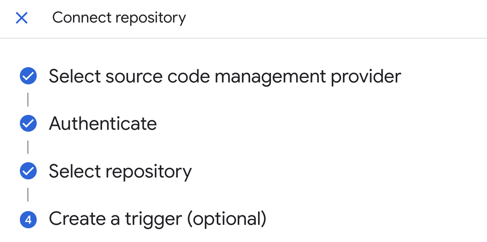

# Why
Since GCP deprecated source repositories, there is a need for an updated deployment pattern that allows: 

- Easy adk with web ui deployment using:
  - Github hosted source
  - Cloudbuild triggers
  - Prod/Non-prod environment separation
  - Terraform/ci/cd


# CICD structure

A simple folder based structure

How it works:

Trigger A: Listens for changes in envs/dev/**. Points to envs/dev/cloudbuild.yaml.

Trigger B: Listens for changes in envs/prod/**. Points to envs/prod/cloudbuild.yaml.

Pros: Maximum clarity. You can't accidentally deploy dev config to prod.

Cons: "Drift." You might add a new feature to Dev but forget to copy the configuration block to Prod.
```
/
├── src/
├── cicd/
│   ├── dev/
│   │   ├── main.tf   (non-prod orientation for memory/settings/instances etc )
│   │   ├── backend.tf
│   │   └── cloudbuild.yaml
│   └── prod/
│       ├── main.tf   (prod orientation for memory/settings/instances, etc)
│       ├── backend.tf
│       └── cloudbuild.yaml

```


## Usage
To get started
- clone the repo, operate in the ```main``` branch 
- set the varables in the .tfvars files (use .tfvars.example as a guide)
- open a terminal in cicd/dev
- run ```terraform init``` to initialize terraform and providers. 
- run ```terraform plan``` to check the build plan
- run ```terraform apply``` to begin the setup 

Note that terraform will not complete due to some chicken/egg problems. 
- Some services may not complete activiation: Solution: allow activation and retry
- Authorization: If you do not have the google cloudbuild app for github installed, you'll need to follow steps below

## Authorization
You will need to authorize the google cloudbuild app to access your github repo. 
Terraform will fail, and offer a URL like: 
https://console.cloud.google.com/cloud-build/triggers;region=global/connect?project=123456789

Clicking it will take you to GCP to complete the authorization. You do not need to create triggers.

 


Before turning it over to the CICD pipeline, you will need to set the state bucket: 

Change /cicd/*/backend.tf to match the output of terraform output 
```terraform
    terraform {
  backend "gcs" {
    bucket = "UPDATE_ME_WITH_OUTPUT_OF_INITIAL_INIT"
    prefix = "cicd"
  }
}
```

Then re-init terraform to allow it to transfer state to GCS: 
From /cicd/dev and /cicd/prod (once you have dev working)
```
terraform init -force-copy
```

Create a ```dev``` branch and push a change to trigger the CICD pipeline to run. 